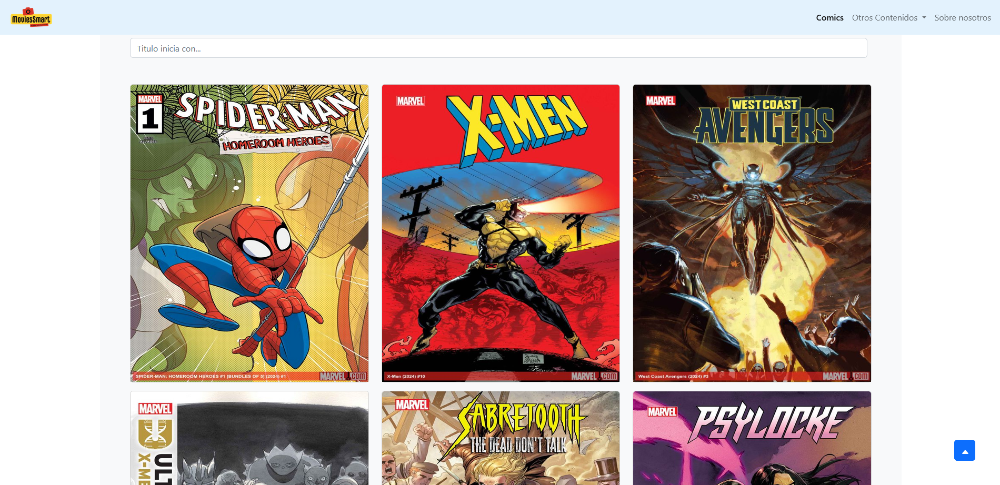
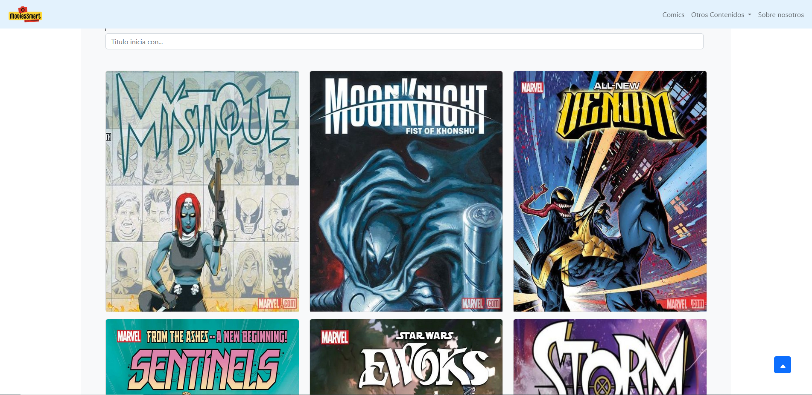
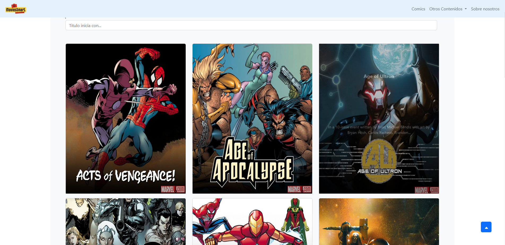
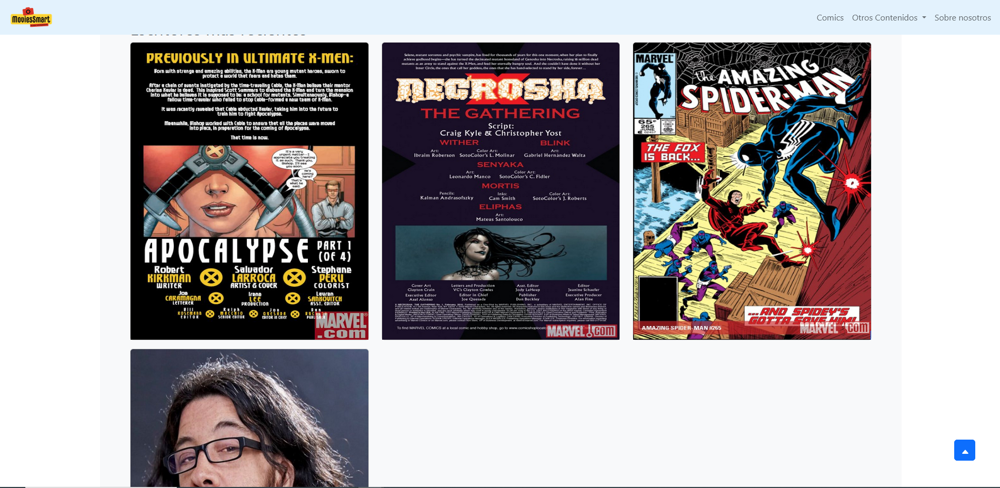
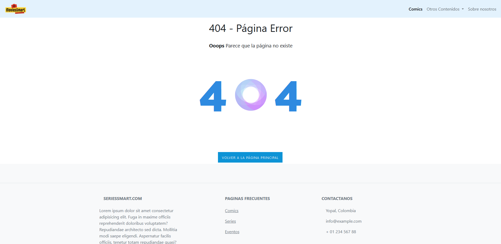

# MoviesSmart Angular

**MoviesSmart Angular** es una aplicación desarrollada en Angular que consume la API de Marvel para mostrar información sobre cómics, series, eventos y escritores. Este proyecto combina una interfaz moderna con datos de alta calidad proporcionados por la API oficial de Marvel.

## Características

- Exploración de cómics populares de Marvel.
- Visualización de series con detalles completos.
- Consulta de eventos históricos del universo Marvel.
- Información sobre los escritores más destacados.
- Interfaz responsive y amigable.

## Tecnologías Utilizadas

- **Angular**: Framework principal para la construcción de la aplicación.
- **TypeScript**: Lenguaje utilizado para una programación más estructurada.
- **Marvel API**: Fuente de datos para los cómics, series, eventos y escritores.
- **SCSS/CSS**: Para el diseño visual y la personalización de estilos.

## Pantallazos

### Página de Inicio


### Sección de Series


### Detalles de un Evento


### Información de Escritores


### Página 404


> Coloca las capturas de pantalla en una carpeta llamada `screenshots` en el directorio raíz del proyecto y actualiza los nombres de archivo según corresponda.


## Requisitos Previos

Antes de comenzar, asegúrate de tener instalado:

- [Node.js](https://nodejs.org/) (versión LTS recomendada)
- [Angular CLI](https://angular.io/cli)

## Instalación

1. Clona este repositorio en tu máquina local:
   ```bash
   git clone https://github.com/tu-usuario/moviessmart-angular.git
   cd moviessmart-angular

    Instala las dependencias:

npm install

Configura tu clave de acceso a la API de Marvel:

    Regístrate en el portal de desarrolladores de Marvel.
    Crea un archivo .env en la raíz del proyecto y añade tu clave:

    MARVEL_API_KEY=tu_clave_aquí

Inicia el servidor de desarrollo:

    ng serve

    Abre la aplicación en tu navegador en http://localhost:4200.

Uso
- Navega por las secciones de cómics, series, eventos y escritores.
- Explora los detalles de cada elemento en una interfaz intuitiva.
- Realiza búsquedas rápidas utilizando el buscador integrado.


Licencia

Este proyecto está bajo la licencia MIT.

¡Gracias por usar MoviesSmart Angular! 💻✨


Si necesitas personalizar algo más, como agregar imágenes o secciones específicas, avísame. 😊

